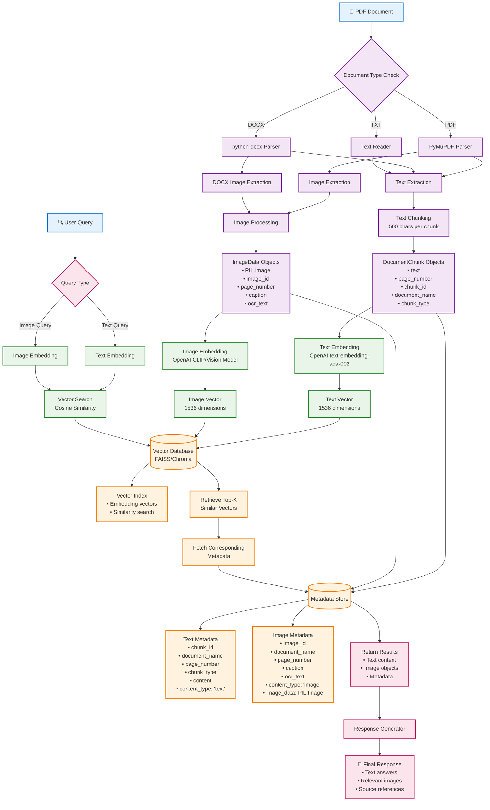

# Multimodal RAG System - Embedding Storage Flowchart



## System Architecture Details

### 🔄 Data Flow Process

1. **Document Ingestion**
   - PDF → PyMuPDF → Text + Images
   - DOCX → python-docx → Text + Embedded Images
   - TXT → Direct text processing

2. **Content Processing**
   - Text: Chunked into 500-character segments
   - Images: PIL objects with OCR text extraction
   - Metadata: Rich contextual information preserved

3. **Embedding Generation**
   - Text: OpenAI text-embedding-ada-002 (1536D)
   - Images: Vision model embeddings (1536D)
   - Unified vector space for multimodal search

4. **Storage Architecture**
   ```
   Vector Database (FAISS/Chroma)
   ├── Text Vectors [1536D float arrays]
   ├── Image Vectors [1536D float arrays]
   └── Vector Index [Similarity search optimization]
   
   Metadata Store
   ├── Text Metadata [JSON objects with content]
   ├── Image Metadata [JSON + PIL.Image objects]
   └── Document Context [Page numbers, sources]
   ```

5. **Query Processing**
   - Query → Embedding → Vector Search → Metadata Retrieval → Response

### 📊 Storage Distribution

| Component | Storage Location | Content Type |
|-----------|------------------|--------------|
| **Embedding Vectors** | Vector DB | Float arrays (1536D) |
| **Text Content** | Metadata Store | Original text strings |
| **Image Objects** | Metadata Store | PIL.Image objects |
| **Document Context** | Metadata Store | JSON metadata |
| **Search Index** | Vector DB | Optimized search structures |

### 🎯 Key Benefits

- **Unified Search**: Text and images in same vector space
- **Rich Context**: Complete metadata preservation  
- **Fast Retrieval**: Optimized vector similarity search
- **Multimodal**: Support for text + visual queries
- **Scalable**: Vector DB handles large document collections