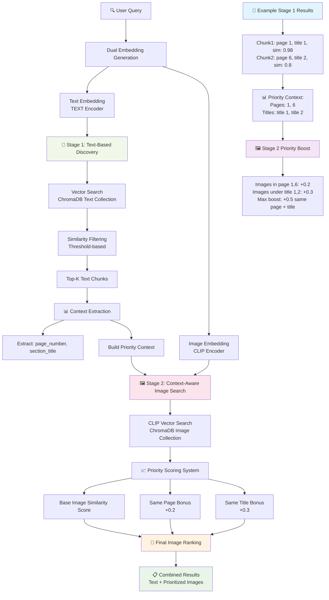
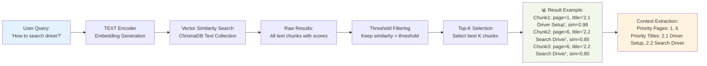
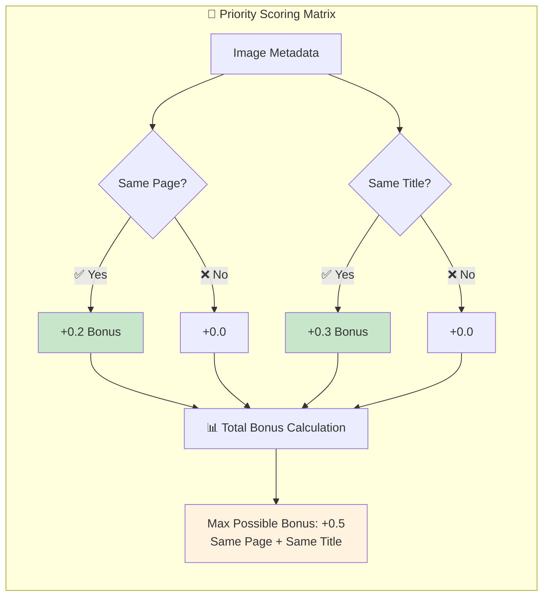
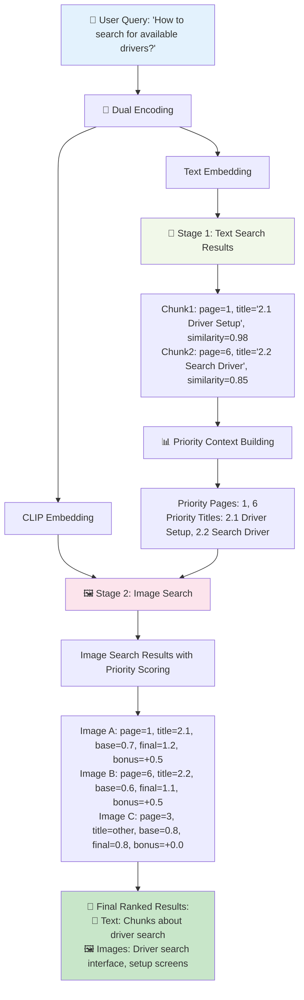

# Two-Stage Enhanced Retrieval Workflow

## System Overview

**Core Observation**: Images in documents typically follow or illustrate text content. Therefore, use text-based answers as reference to query relevant images.

## Data Storage Structure

```mermaid
flowchart TD
    subgraph "💾 ChromaDB Collections"
        subgraph "📝 Text Collection"
            A[Text Embedding<br/>TEXT Encoder]
            B[Metadata:<br/>• page_number<br/>• chunk_id: doc_p1_c0<br/>• document_name<br/>• section_title]
            C[Document:<br/>chunk content]
        end
        
        subgraph "🖼️ Image Collection"
            D[Image Embedding<br/>CLIP Encoder]
            E[Metadata:<br/>• page_number<br/>• image_id<br/>• document_name<br/>• section_title: 2.2 Search driver<br/>• caption: None<br/>• ocr_text: Search for driver<br/>• surrounding_text: Click on [IMAGE_HERE] to search...]
        end
    end
    
    style A fill:#e3f2fd
    style D fill:#fce4ec
```

## Two-Stage Retrieval Process



## Stage 1: Text-Based Discovery Detail



## Stage 2: Context-Aware Image Search Detail

```mermaid
flowchart TD
    A[Stage 1 Context:<br/>Pages: 1, 6<br/>Titles: 2.1 Driver Setup, 2.2 Search Driver] --> B[User Query CLIP Embedding]
    
    B --> C[Vector Search<br/>All Images in ChromaDB]
    
    C --> D[Base Similarity Scores]
    
    D --> E[Priority Scoring Logic]
    
    E --> F{Image Page in [1, 6]?}
    E --> G{Image Title matches?}
    
    F -->|Yes| H[+0.2 Page Bonus]
    F -->|No| I[No Page Bonus]
    
    G -->|Yes| J[+0.3 Title Bonus]
    G -->|No| K[No Title Bonus]
    
    H --> L[Calculate Final Score]
    I --> L
    J --> L
    K --> L
    
    L --> M[Final Score = Base + Page Bonus + Title Bonus]
    
    M --> N[📊 Scoring Example:<br/><br/>Image A: page=1, title=2.1 Driver Setup<br/>Base: 0.7, Page: +0.2, Title: +0.3, Final: 1.2<br/><br/>Image B: page=3, title=Other<br/>Base: 0.8, Page: +0.0, Title: +0.0, Final: 0.8<br/><br/>Image C: page=6, title=2.2 Search Driver<br/>Base: 0.6, Page: +0.2, Title: +0.3, Final: 1.1]
    
    N --> O[🎯 Ranked Results:<br/>1. Image A score 1.2<br/>2. Image C score 1.1<br/>3. Image B score 0.8]
    
    style A fill:#fff3e0
    style M fill:#f3e5f5
    style N fill:#e8f5e8
    style O fill:#c8e6c9
```

## Priority Bonus System



## Complete Flow Example



## Key Benefits

### 🎯 **Text-First Approach**
- Leverages the fact that images typically illustrate text content
- Uses text context to guide image selection

### 📊 **Priority Scoring System**
- **Page Priority (+0.2)**: Images on same pages as relevant text
- **Title Priority (+0.3)**: Images under same section titles
- **Maximum Boost (+0.5)**: Same page AND same title

### 🔍 **Two-Stage Efficiency**
- **Stage 1**: Fast text search identifies relevant context
- **Stage 2**: Context-aware image search with priority boosting

### 📈 **Enhanced Relevance**
- Combines semantic similarity with structural document context
- Ensures images are contextually related to text answers