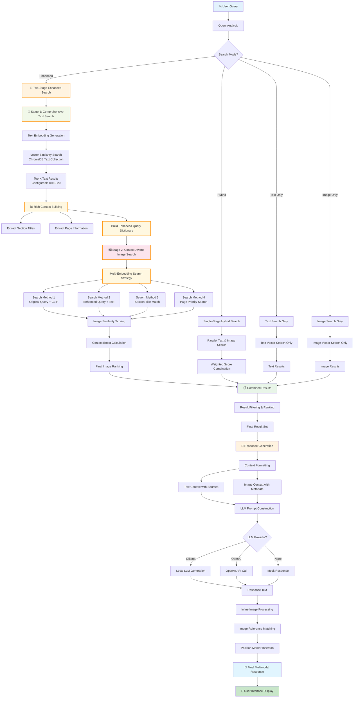
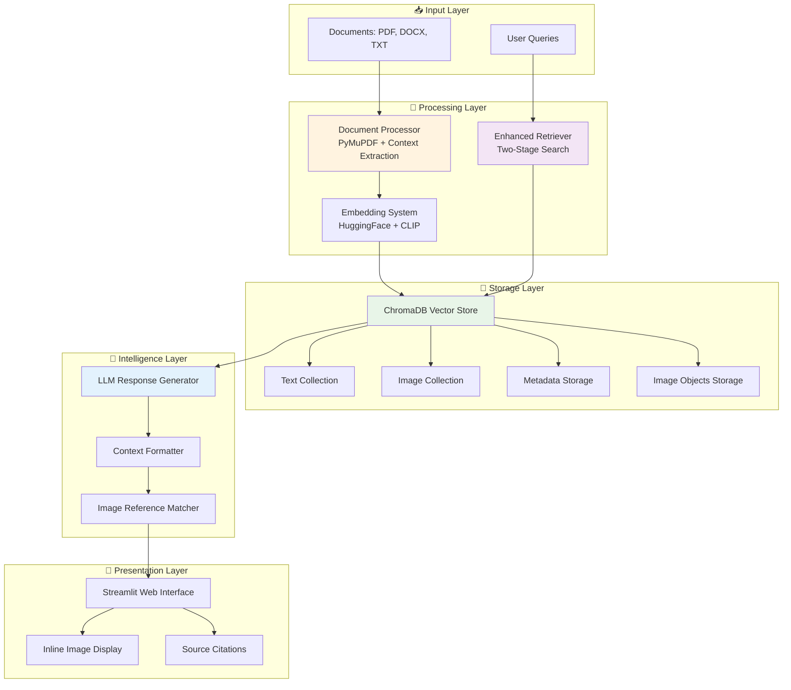

# Two-Stage Multimodal RAG System Workflow

## Document Ingestion Pipeline

```mermaid
flowchart TD
    A[📄 Document Upload] --> B{File Type?}
    
    B -->|PDF| C[PyMuPDF Processing]
    B -->|DOCX| D[DOCX Processing]
    B -->|TXT| E[TXT Processing]
    
    C --> F[Text Extraction]
    C --> G[Image Extraction]
    D --> F
    D --> G
    E --> F
    
    F --> H[Section Title Detection]
    H --> I[Text Chunking with Titles]
    
    G --> J[Image Context Extraction<br/>PyMuPDF Built-in Functions]
    J --> K{Image Type?}
    
    K -->|Inline <100px| L[Left/Right Text Extraction<br/>Same Line Context]
    K -->|Block Image| M[Above/Below Text Extraction<br/>Paragraph Context]
    
    L --> N[Position Marker Insertion<br/>[IMAGE_HERE]]
    M --> N
    
    N --> O[Rich Context Generation]
    O --> P[Multiple Embeddings Creation]
    
    I --> Q[Text Embedding<br/>HuggingFace/Ollama]
    P --> R[Image Embedding<br/>CLIP Vision]
    P --> S[Text Context Embedding<br/>Combined Text]
    P --> T[Rich Context Embedding<br/>Surrounding Text]
    
    Q --> U[ChromaDB Text Collection]
    R --> V[ChromaDB Image Collection]
    S --> V
    T --> V
    
    U --> W[Vector Store with Metadata]
    V --> W
    
    W --> X[🎯 Ingestion Complete]

    style A fill:#e1f5fe
    style X fill:#c8e6c9
    style J fill:#fff3e0
    style N fill:#f3e5f5
```

## Two-Stage Retrieval Pipeline



## Enhanced Search Strategy Detail

```mermaid
flowchart LR
    A[Enhanced Query Dictionary] --> B[🔍 Multi-Method Image Search]
    
    B --> C[Method 1: Original Query<br/>+ CLIP Embedding]
    B --> D[Method 2: Enhanced Query<br/>+ Rich Text Embedding]
    B --> E[Method 3: Section Title<br/>+ Exact Match]
    B --> F[Method 4: Page Context<br/>+ Priority Scoring]
    
    C --> G[Base Similarity Score]
    D --> H[Context Similarity Score]
    E --> I[Title Match Bonus<br/>+0.15 if exact match]
    F --> J[Page Priority Bonus<br/>+0.1 for same page]
    
    G --> K[🎯 Final Score Calculation]
    H --> K
    I --> K
    J --> K
    
    K --> L[Context Boost = Σ(bonuses)]
    L --> M[Final Score = Base + Boost]
    
    M --> N[📊 Ranked Results]
    
    style A fill:#e8f5e8
    style B fill:#fff3e0
    style K fill:#f3e5f5
    style N fill:#e1f5fe
```

## PyMuPDF Image Context Extraction

```mermaid
flowchart TD
    A[🖼️ Image Detection] --> B[Multiple bbox Detection Methods]
    
    B --> C[Method 1: page.get_image_bbox<br/>Full Image List]
    B --> D[Method 2: Drawing Objects<br/>page.get_drawings]
    B --> E[Method 2.5: Transform Matrix<br/>Position Calculation]
    B --> F[Method 3: Text Block Gaps<br/>Intelligent Estimation]
    B --> G[Method 4: Equal Distribution<br/>Fallback Strategy]
    
    C --> H{bbox Found?}
    D --> H
    E --> H
    F --> H
    G --> H
    
    H -->|Yes| I[🎯 Precise bbox Available]
    H -->|No| J[⚠️ Fallback Context]
    
    I --> K{Image Type Analysis}
    K -->|Small <100px<br/>Inline Image| L[Left/Right Text Extraction]
    K -->|Large Image<br/>Block Image| M[Above/Below Text Extraction]
    
    L --> N[page.get_textbox<br/>Left Region]
    L --> O[page.get_textbox<br/>Right Region]
    
    M --> P[page.get_textbox<br/>Above Region]
    M --> Q[page.get_textbox<br/>Below Region]
    
    N --> R[Left Text: 'click on']
    O --> S[Right Text: 'button to add']
    P --> T[Above Text: 'Previous paragraph']
    Q --> U[Below Text: 'Next paragraph']
    
    R --> V[Inline Context:<br/>'click on [IMAGE_HERE] button to add']
    S --> V
    T --> W[Block Context:<br/>'Previous paragraph [IMAGE_HERE] Next paragraph']
    U --> W
    
    J --> X[Text Splitting Fallback]
    
    V --> Y[📋 Rich Context Result]
    W --> Y
    X --> Y
    
    style A fill:#e3f2fd
    style I fill:#c8e6c9
    style V fill:#fff3e0
    style W fill:#fff3e0
    style Y fill:#e1f5fe
```

## Data Flow Architecture



## Key Features Summary

### 🎯 Two-Stage Enhanced Search
1. **Stage 1**: Comprehensive text search with configurable top-k
2. **Stage 2**: Context-aware image search with multiple methods

### 🖼️ Smart Image Context Extraction
- **Inline Images**: Left/right text extraction for buttons, icons
- **Block Images**: Above/below text extraction for diagrams, screenshots
- **Position Markers**: Accurate [IMAGE_HERE] placement

### 📊 Multi-Embedding Strategy
- **Text Embeddings**: HuggingFace/Ollama for semantic search
- **Image Embeddings**: CLIP for visual similarity
- **Context Embeddings**: Rich surrounding text for enhanced matching

### 🎯 Contextual Scoring System
- **Base Similarity**: Vector cosine similarity
- **Context Boost**: Section title matching, page priority
- **Final Ranking**: Combined scoring with configurable weights

### 🤖 Intelligent Response Generation
- **Multimodal Responses**: Text with inline images
- **Source Citations**: Document and page references
- **Confidence Scoring**: Quality assessment metrics